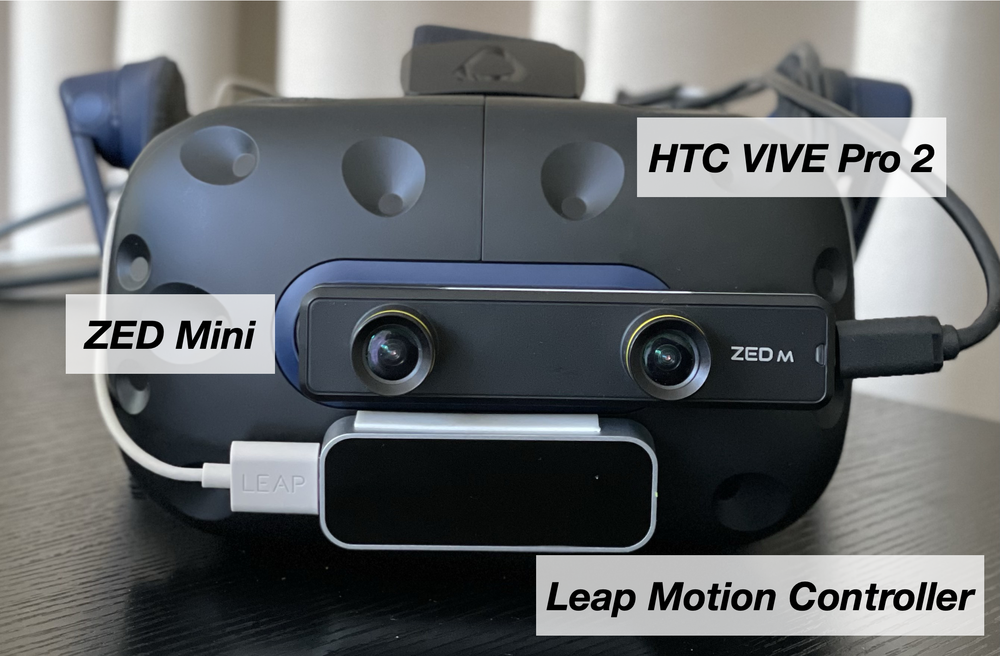

# <span style="color: rgb(0, 255, 205);">**GradualReality**</span>


**Authors**: [Hyuna Seo](https://hyunaseo.github.io), Juheon Yi, Rajesh Balan, Youngki Lee 

**Publication**: ACM UIST, Oct 2024

**Paper**: [GradualReality: Enhancing Physical Object Interaction in Virtual Reality via Interaction State-Aware Blending](https://doi.org/10.1145/3654777.3676463)

## Research project description
We present **GradualReality** system that enables interaction with physical objects in the immersive virutal environment. Most prior work has relied on the Pass-Through technique, which excessively exposes real-world information in the virtual environment to support interaction. However, this causes an extreme trade-off between usability and immersion, deteriorating the user experience and hindering daily VR usage. To address this issue, we propose an **Interaction State-Aware Blending** approach for GradualReality system, which gradually blends real-world information in the virtual environment based on the current user's interaction context.

## Hardware Requirements
- HTC VIVE PRO 2
- VIVE Tracker 3.0 for object tracking 
- Leap Motion contorller 1 for hand tracking 
- ZED Mini camera for Pass-Through implementation 
- Windows 11 computer with 8 GB RAM or more and NVIDIA GTX 2070 or higher satisfying ZED Mini requirements 

<details>
    <summary>ZED Mini and Leap Motion Setup with HTC Vive Pro 2</summary>
    We have attached the ZED Mini and Leap Motion to the HTC VIVE PRO 2 as shown below.
    <p align="left">
        
    </p>

1. **Zed Mini**
- The ZED Mini should be aligned with the center of the front camera of the HTC VIVE PRO 2.
- Putting it below the HMD's camera is one possible option, but you will need to adjust the zed camera's parameters, which ~~is a disaster~~ can make implementing Pass-Through very difficult (it becomes challenging to accurately apply Pass-Through to the exact position of objects).

2. **Leap Motion controller**
- The Leap Motion is attached below the front camera of the HTC VIVE PRO 2.
- Since the ZED Mini obstructs the front camera, it is not possible to use hand tracking provided by VIVE, Steam, or OpenXR, making the Leap Motion necessary.

</details>

## Installation 
1. Clone this repository. 
```bash
git clone https://github.com/hyunaseo/GradualReality.git
cd GradualReality 
git lfs checkout
```
2. Create a new Unity project using the 3D Built-in Render Pipeline with Unity Editor version 2021.3.2f1.

3. Install XR Plugin Management through Edit -> Project Settings.

4. In the Package Manager, import VIVE Input Utility 1.19.0 and SteamVR 2.7.3.

5. In Project Settings -> Player -> Other Settings, set (1) Color Space to Gamma and (2) Allow downloads over HTTP to Always Allowed.

6. In Project Settings -> XR Plugin Management, select OpenVR Loader and set Stereo Rendering Mode in OpenVR to Multi Pass.

7. Download and import ZED SDK 3.8.0 from the provided [link](https://www.stereolabs.com/en-kr/developers/release/3.8).

8. Follow the provided [link](https://github.com/ultraleap/UnityPlugin?tab=readme-ov-file#Installation) to install Ultraleap SDK using OpenUPM, then install Ultra Tracking version 6.6.0 from My Registries in the Package Manager.

9. Import GradualReality.unitypackage from the cloned repository into your Unity project.

10. Open `Assets/Scenes/Gradual Reality Main Scene` and play. 

## Object Settings
This section outlines the step-by-step process for adding your own physical object to the virtual scene with the corresponding blending methods. 

### Step 1: Get Tracker's Serial Number

1. Open `Assets/Scenes/Object Registration Scene`.
2. Connect the VIVE Tracker 3.0 to your PC.
3. Activate only the `Get Tracker Serial Numbers` component on the `Object Settings` game object.
4. Play the scene to obtain the tracker's serial number, which will be provided in the log starting with "Object Setting Step 1".

### Step 2: Map Tracker to Your Object

1. Activate only the `Map Tracker` component on the `Object Settings` game object.
2. Enter (1) the serial number obtained in Step 1 and (2) the name of the object to be mapped.

### Step 3: Add Your Object's Blending Methods

1. Add the prefab located at `Assets/Prefabs/[Name Your Object]` as a child under the `Object Settings` in the scene, and then name it as you enter in Step 2.
2. Add the necessary game objects as children of the Virtual Proxy and Affordance Contour game objects. Resize and position them appropriately.
3. Measure the size of your physical object and enter these dimensions (in meters) for the Boundary Box and Pass-Through game objects.
4. Adjust the position of the buttons as needed.

### Step 4: Save Your `Object Settings` Prefab

1. After adding all your objects under the `Object Settings` and completing the `Map Tracker` setup, rename `Object Settings` to `My Object Setting`.
2. Save it as a prefab in `Assets/Prefabs`.

### Step 5: Load Your `Object Settings` Prefab to the Main Scene

1. Open `Assets/Scenes/Gradual Reality Main Scene`.
2. Add the saved prefab from the previous step to this scene.